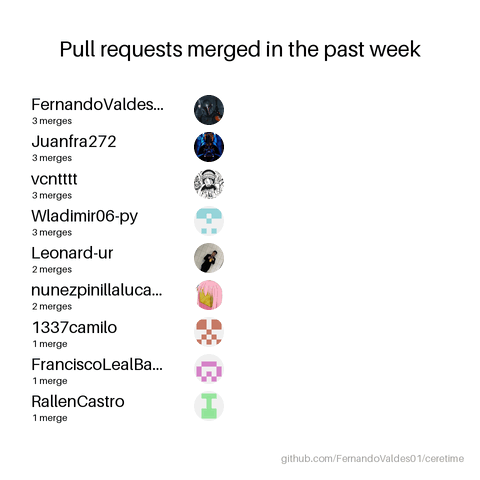

# **ceretime**

## Carrera del equipo

[](https://github.com/FernandoValdes01/ceretime/actions/workflows/release-balls.yml)

Generada con [Release Balls](https://github.com/maria-rcks/release-balls) a partir de las PR fusionadas durante los siete días previos al 03/10/2026. Cada bola representa a un autor; su velocidad depende de cuántas PR fusionadas tiene en ese período.

El [workflow Release Balls](https://github.com/FernandoValdes01/ceretime/actions/workflows/release-balls.yml) genera GIF, video y datos al publicar una release o ejecutarlo manualmente. Los archivos quedan como artefactos de Actions. Para renovar esta imagen, descarga el GIF y reemplaza `.github/assets/release-balls.gif` mediante una PR.

## Requisitos

Para integrarte completamente al flujo (desarrollo, issue tracker y pull requests) necesitas `bun` y la GitHub CLI (`gh`).

- Arch Linux: `sudo pacman -S github-cli`
- Windows: `winget install --id GitHub.cli`

Después, autentica la CLI una vez por máquina con `gh auth login`.

## Comandos mínimos de arranque desde cero

- Instala dependencias limpias desde la raíz con `bun install`.
- Levanta todo con un solo comando según tu área (backend + app en la misma terminal):
  a) TI2 (web): `bun run dev:web`
  b) TI4 (mobile): `bun run dev:mobile`
- La primera vez, `convex dev` abre un asistente interactivo de login y vinculación; el detalle está en [convex/README.md](convex/README.md).
- Para TI2, el procedimiento completo desde un clon limpio, con el dataset ficticio y su comprobación, está en [Entorno TI2 desde un clon limpio](#entorno-ti2-desde-un-clon-limpio).

## Variables de entorno

Los `.env.example` listan las variables requeridas, sin valores reales. Los `.env.local` guardan los valores y nunca se suben a Git.

- **Raíz**: sin acción manual, `bunx convex dev` crea solo el `.env.local`, con `CONVEX_DEPLOYMENT`, `VITE_CONVEX_URL` y `VITE_CONVEX_SITE_URL`.
- **`apps/web`**: se copian del `.env.local` de la raíz, porque cada integrante trabaja contra su propio deployment de desarrollo (paso 6 de la guía del entorno TI2).
- **`apps/mobile`**: copiar la plantilla y pedir los valores al equipo:

```bash
cp apps/mobile/.env.example apps/mobile/.env.local
```

`VITE_*` queda visible en el navegador y `EXPO_PUBLIC_*` en la app: nunca pongas secretos en esas variables.

**Queda estrictamente prohibido incluir contraseñas, tokens de API o secretos de autenticación (como BETTER_AUTH_SECRET) dentro de apps/mobile/.env.example, apps/web/.env.example o en el código cliente.**

**Los secretos del backend se configuran directamente de forma segura en el entorno de Convex, nunca en los archivos de ejemplo del monorepo.**

## Entorno TI2 desde un clon limpio

Levanta la web y el backend con el dataset ficticio del Sprint 1 (TI2-30) en tu propio deployment de desarrollo de Convex. Los comandos son para Git Bash o una terminal POSIX, desde la raíz del repositorio. Necesitas acceso al proyecto `ceretime` en Convex: si no aparece al vincular, pídelo al equipo.

1. Clona el repositorio. En Windows, desactiva la conversión de finales de línea: con la configuración por defecto de Git for Windows (`core.autocrlf=true`) los archivos quedan con CRLF y `bun run format:check` falla en todos, aunque la CI en Linux pase.

   ```bash
   git clone -c core.autocrlf=false https://github.com/FernandoValdes01/ceretime.git
   cd ceretime
   ```

2. Instala las dependencias sin modificar el lockfile:

   ```bash
   bun install --frozen-lockfile
   ```

3. Vincula tu deployment de desarrollo. La primera vez se abre el asistente de login: elige el proyecto existente `ceretime` (detalle en [convex/README.md](convex/README.md)). En un deployment nuevo, la subida falla con `MissingEnvironmentVariables` hasta completar el paso 4; es lo esperado.

   ```bash
   bunx convex dev --once
   ```

4. Configura las variables del backend en tu deployment, una sola vez. `convex/convex.config.ts` las declara obligatorias, salvo `TEST_SEEDS_ENABLED`, que habilita las semillas de desarrollo. El secreto se genera dentro del comando y no aparece en pantalla. Con los valores ficticios de Google la web queda en la pantalla de acceso, y eso basta para comprobar el entorno y el dataset; para iniciar sesión hacen falta las credenciales del cliente OAuth de desarrollo y el callback de tu deployment registrado, como indica [convex/README.md](convex/README.md). `bunx convex env list` muestra los valores: no compartas su salida.

   ```bash
   bunx convex env set SITE_URL http://localhost:5173
   bunx convex env set BETTER_AUTH_SECRET "$(bun -e "console.log(Buffer.from(crypto.getRandomValues(new Uint8Array(32))).toString('base64'))")"
   bunx convex env set TEST_SEEDS_ENABLED true
   bunx convex env set GOOGLE_CLIENT_ID sin-login-en-local
   bunx convex env set GOOGLE_CLIENT_SECRET sin-login-en-local
   ```

5. Sube las funciones y carga el dataset ficticio. La carga responde `{ "loaded": true }` la primera vez y `{ "loaded": false }` después, sin duplicar datos. El inventario está en [docs/dataset-ficticio.md](docs/dataset-ficticio.md).

   ```bash
   bunx convex dev --once
   bunx convex run fictitiousData:load
   ```

6. Copia las variables públicas a la web, que lee su `.env.local` desde `apps/web`:

   ```bash
   grep '^VITE_' .env.local > apps/web/.env.local
   echo 'VITE_SITE_URL=http://localhost:5173' >> apps/web/.env.local
   ```

7. Levanta el entorno con `bun run dev:web`, que ya incluye `convex dev`: mientras desarrollas no lo ejecutes aparte. La web queda en `http://localhost:5173`.

### Comprobación

- `bunx convex run presentation/session:getSessionState '{}'` responde `{"status":"unauthenticated"}`.
- En el panel de Convex, la pestaña Data de tu deployment muestra `users` 6, `requests` 4, `requestTransitions` 5, `accompaniments` 1 y `accompanimentAssignments` 2.
- `http://localhost:5173` muestra el acceso institucional, sin el aviso de configuración faltante.
- `bun run test:convex`, `bun run test:web`, `bun run lint` y `bun run format:check` terminan sin errores.

En producción no se define `TEST_SEEDS_ENABLED`: sin esa variable, `createTestUser`, `createTestRequest` y `fictitiousData:load` se rechazan.

## Calidad de código

Oxlint y Oxfmt se configuran en la raíz. Oxfmt también comprueba los archivos de configuración y documentación compatibles de la raíz, junto con `apps/`, `convex/`, `packages/` y `.github/` cuando esas carpetas existan. Las salidas generadas, dependencias y builds quedan excluidas. Estas comprobaciones no reemplazan typecheck, pruebas ni builds.

La configuración manual para exigir estos checks y mantener las PR actualizadas con `main` está en [docs/ci-protections.md](docs/ci-protections.md).

Desde la raíz del monorepo:

```sh
bun install --frozen-lockfile
bun run lint
bun run format:check
```

Para aplicar el formato automáticamente, ejecuta `bun run format` y vuelve a comprobar con `bun run format:check`.

## Issue tracker

Se recomienda conectar tu agente al MCP de Linear, ya están configurados en `opencode.json`, `.codex/config.toml` y `.mcp.json`, cada miembro debe autenticarse una vez por máquina, los tokens quedan en cada máquina y no se versionan.

Opencode:

```sh
opencode mcp auth linear
opencode mcp list
```

Codex:

```sh
codex mcp login linear
codex mcp list
```

Codex sólo carga `.codex/config.toml` cuando el proyecto está marcado como confiable. Al abrir el repositorio por primera vez, acepta la confianza del proyecto; si lo abres como no confiable, la configuración MCP definida en el repositorio no se cargará.

Claude Code:

```sh
claude mcp login linear
claude mcp list
```

## Flujo de trabajo

1. En Linear, abre la issue asignada y revisa su descripción, criterios y dependencias.
2. Crea o cambia a la rama que sugiere Linear, respetando el formato `usuario/TEAM-nnn-slug`.
3. Pide al agente que trabaje en esa issue. Antes de empezar debe confirmar la rama y el alcance.
4. Al terminar, ejecuta las validaciones del proyecto y abre la PR ya sea manual o con `gh pr create`, siguiendo los lineamientos establecidos.
5. Antes de pedir revisión, abre una sesión nueva del agente y pídele: `Ejecuta la skill self-review sobre esta PR`. La sesión nueva permite revisar el cambio con una perspectiva independiente de la implementación. La skill contrasta el cambio con la issue, corrige el título si es necesario y deja el resultado comentado en GitHub.

### Workflows manuales

Estos workflows no se ejecutan automáticamente. Pídeselos al agente por su nombre cuando los necesites:

- `grill-with-docs`: cuestionar y refinar un plan, dejando registradas las decisiones en la documentación.
- `to-questionnaire`: convertir dudas o contradicciones sobre el alcance en preguntas concretas para el grupo de TI4.
- `handoff`: opción avanzada para dejar el contexto y el estado del trabajo preparados cuando otro agente o integrante deba continuar.
