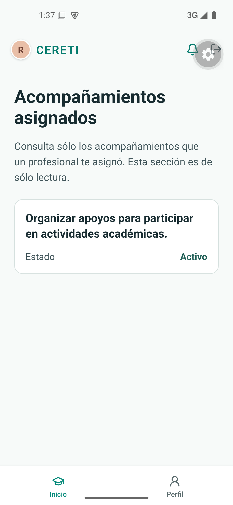
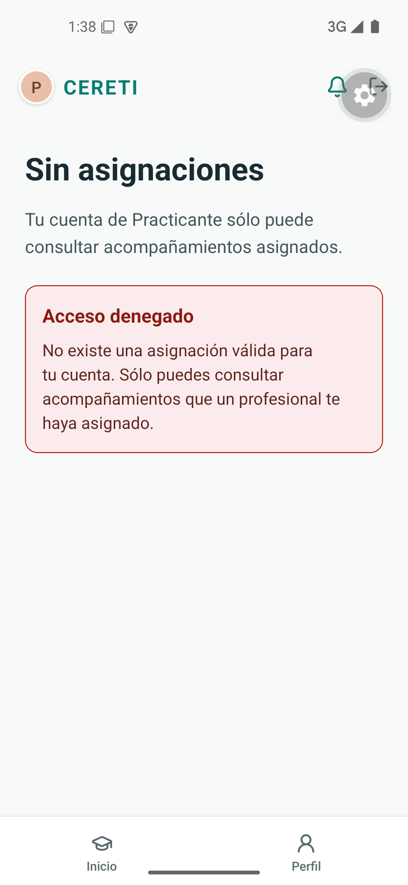

# Evidencia nativa de TI4-10

Recorrido ejecutado el 22 de septiembre de 2026 sobre el commit de implementación `12732a1`, en el AVD `Pixel_5_Liviano` con Android 15 y una compilación de desarrollo de Expo. La aplicación se compiló con Java 17 y los escenarios usaron exclusivamente los datos ficticios incluidos en el adaptador local.

## Practicante con asignación

Al ingresar como **Practicante**, la pantalla mostró únicamente el acompañamiento asignado a la cuenta ficticia. La tarjeta presentó el objetivo y el estado, sin acciones de edición ni información de otros estudiantes.

## Practicante sin asignación

Al ingresar como **Practicante sin asignación**, la pantalla no mostró acompañamientos y presentó el estado **Acceso denegado**, explicando que la cuenta sólo puede consultar elementos asignados por un profesional.

<table>
<tr>
<td align="center"> Con asignación</td>
<td align="center"> Sin asignación</td>
</tr>
</table>

## Resultado

El recorrido quedó aprobado en Android para ambos límites de autorización: una asignación válida habilita la consulta de sólo lectura y la ausencia de asignación impide acceder al listado. Las capturas no contienen información personal real ni secretos de entorno.
