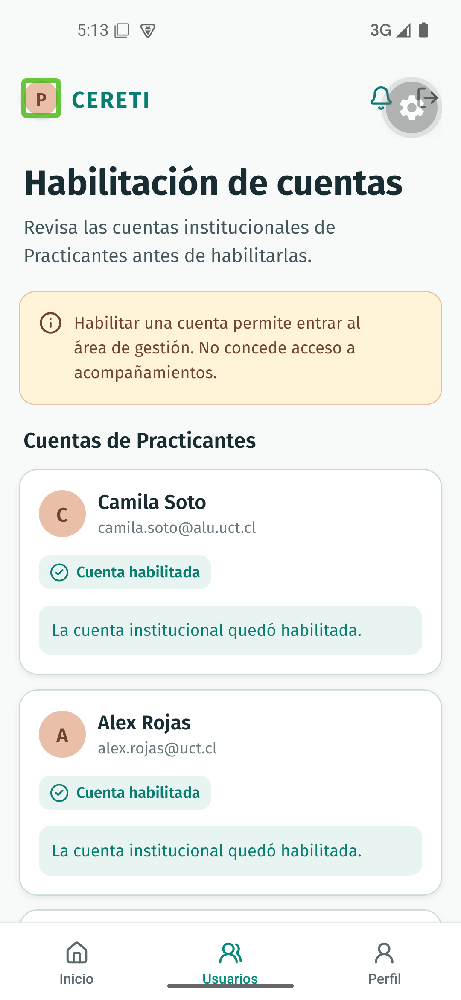

# Evidencia nativa de TI4-11

Recorrido ejecutado el 21 de septiembre de 2026 sobre el commit `023e7950cdfcf69fc5b0f44732fd414d7a62aa95`, en el AVD `Pixel_5_Liviano` con Android 15, API 35 y el development build de CERETIME. La compilación e instalación se ejecutaron con `bun run mobile:android` y JDK 17; el flujo utiliza el adaptador mock de cuentas.

## Acceso del Administrador

Desde el selector de roles se ingresó como Administrador y se abrió **Habilitación de cuentas** desde Inicio. La pantalla muestra la advertencia de que habilitar una cuenta permite entrar al área de gestión, pero no concede acceso a acompañamientos. El botón verde de acceso aparece correctamente en Android.

## Cuentas pendientes

La lista mostró a Camila Soto (`camila.soto@alu.uct.cl`), Alex Rojas (`alex.rojas@uct.cl`) y Matías Vera (`matias.vera@example.com`) en estado **Pendiente**, con sus acciones de habilitación visibles.

## Habilitación válida

Camila Soto pasó de **Pendiente** a **Cuenta habilitada** y la pantalla confirmó que la cuenta institucional quedó habilitada.

## Habilitación de personal

Alex Rojas también pasó a **Cuenta habilitada**, lo que comprueba el dominio institucional `@uct.cl` aceptado por el contrato del Backend.

## Rechazo de dominio

Al intentar habilitar a Matías Vera, la cuenta permaneció en **Pendiente** y se mostró el mensaje `Solo puedes habilitar cuentas institucionales @alu.uct.cl o @uct.cl.`.

## Resultado

El recorrido selector de rol → Administrador → Habilitación de cuentas quedó aprobado en Android. Las acciones son visibles, ambos dominios institucionales se habilitan y el dominio externo se rechaza sin cambiar su estado.
