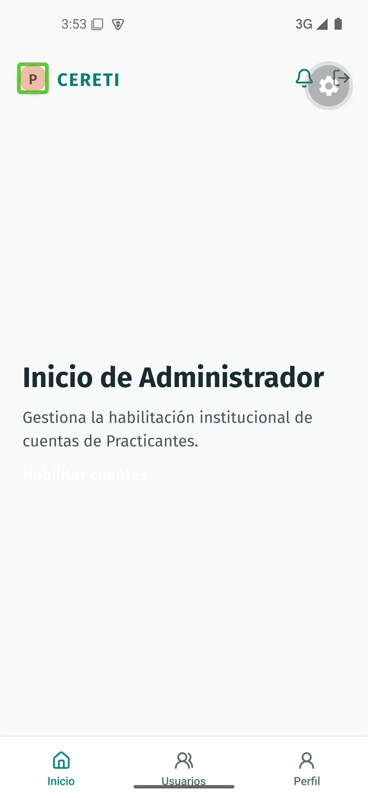
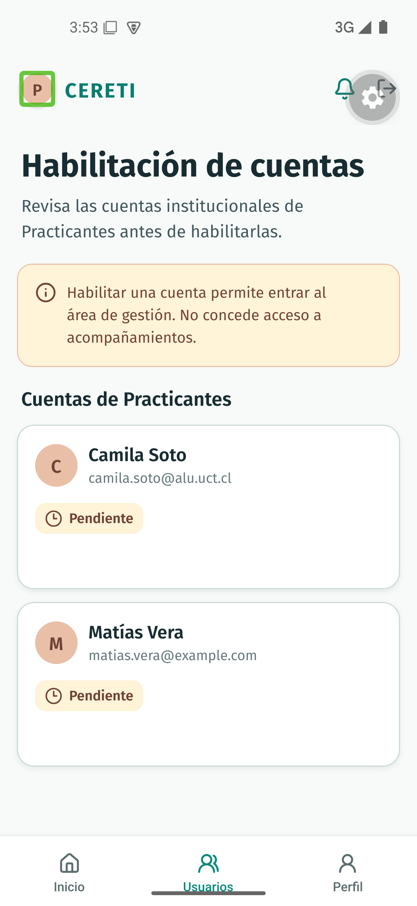
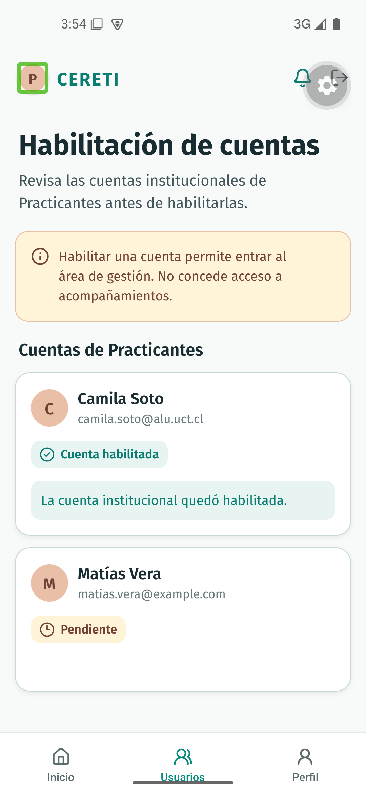
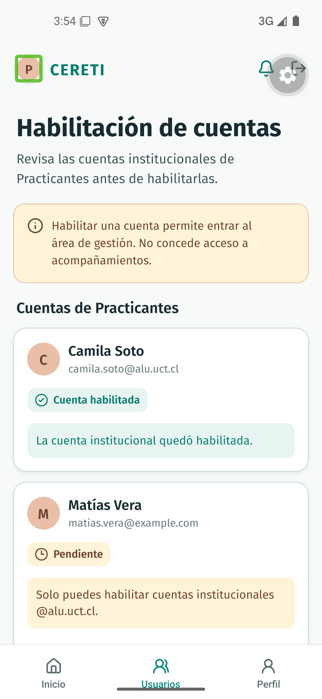

# Evidencia nativa de TI4-11

Recorrido ejecutado el 21 de septiembre de 2026 sobre el commit `2e05d56cc9e42dd385b9228fa5f63a50e84e5665`, en el AVD `Pixel_5_Liviano` con Android 15, API 35 y el development build de CERETIME. La compilación e instalación se ejecutaron con `bun run mobile:android` y JDK 17; el flujo utiliza el adaptador mock de cuentas.

## Acceso del Administrador

Desde el selector de roles se ingresó como Administrador y se abrió **Habilitación de cuentas** desde Inicio. La pantalla muestra la advertencia de que habilitar una cuenta permite entrar al área de gestión, pero no concede acceso a acompañamientos.

## Cuentas pendientes

La lista mostró a Camila Soto (`camila.soto@alu.uct.cl`) y Matías Vera (`matias.vera@example.com`) en estado **Pendiente**.

## Habilitación válida

Camila Soto pasó de **Pendiente** a **Cuenta habilitada** y la pantalla confirmó que la cuenta institucional quedó habilitada.

## Rechazo de dominio

Al intentar habilitar a Matías Vera, la cuenta permaneció en **Pendiente** y se mostró el mensaje `Solo puedes habilitar cuentas institucionales @alu.uct.cl.`.

## Resultado

El recorrido selector de rol → Administrador → Habilitación de cuentas quedó aprobado en Android, incluyendo el caso válido, la transición de estado y el rechazo controlado por dominio.
