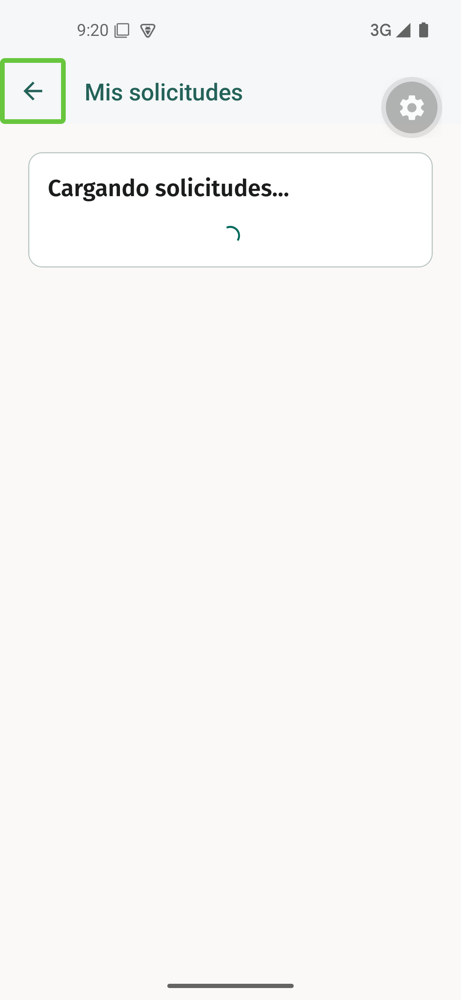
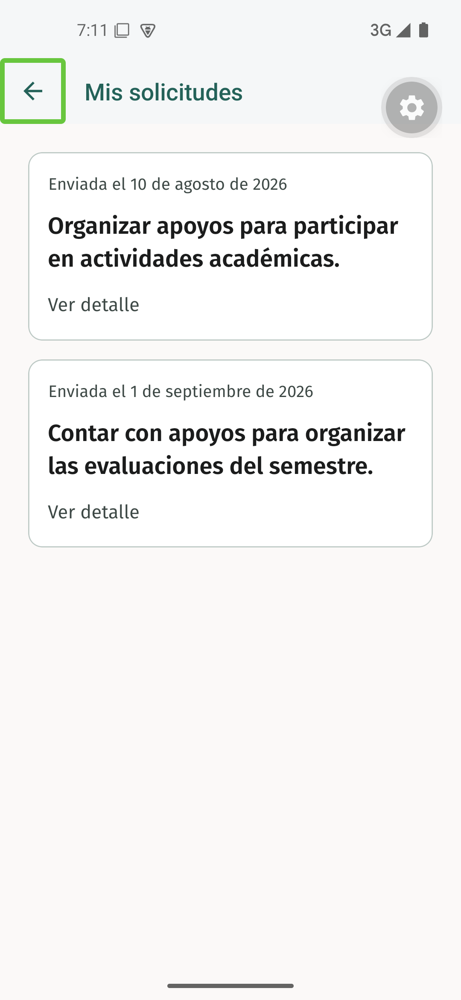
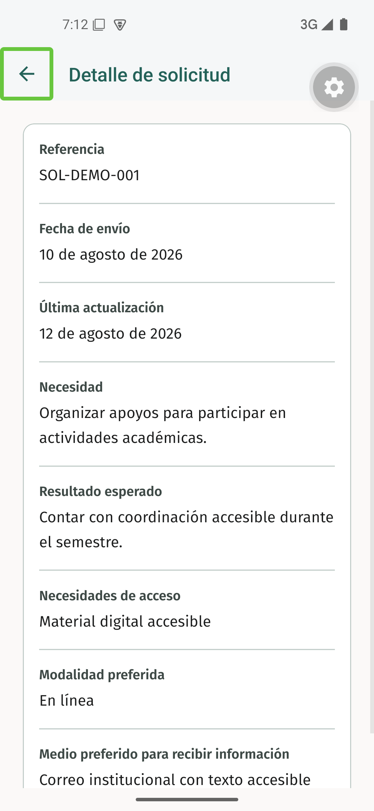
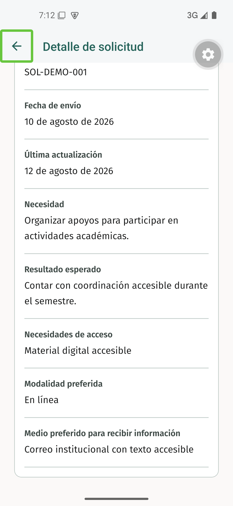
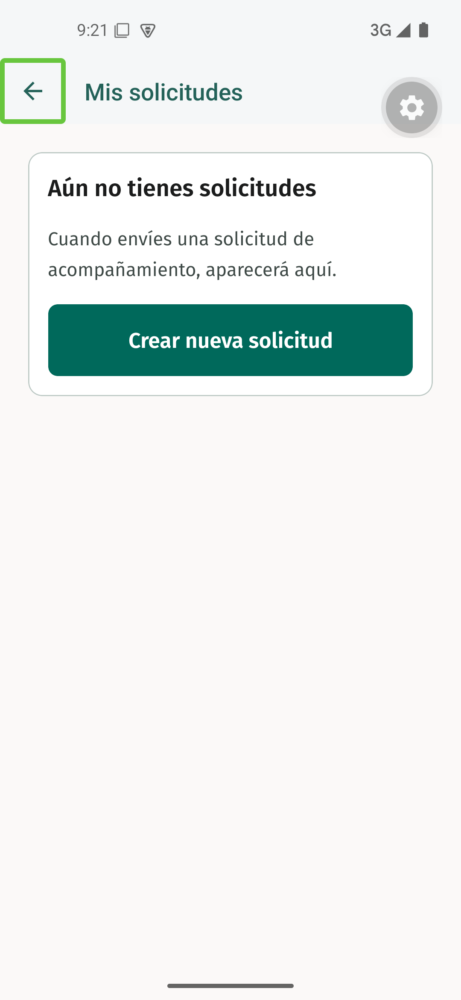

# Evidencia nativa de TI4-19

Recorrido ejecutado el 14 de septiembre de 2026 sobre el commit de implementación `686a912`, en el AVD `Pixel_5_Liviano` con Android 15, API 35, y una compilación de desarrollo de Expo. Los escenarios se activaron únicamente mediante `EXPO_PUBLIC_STUDENT_AREA_DEMO_MODE` y `EXPO_PUBLIC_STUDENT_AREA_DELAY_MS`.

## Carga

Con el modo `success` y una demora de 5000 ms, el acceso desde **Inicio de Estudiante** mostró un único mensaje de carga junto al indicador antes de presentar los datos.

## Éxito y navegación al detalle

El listado presentó dos solicitudes de la proyección del estudiante sin exponer sus identificadores internos. La jerarquía de accesibilidad presentó cada tarjeta como una única acción con necesidad y fecha de envío. Al activar la primera tarjeta se abrió su detalle y se comprobaron la referencia `SOL-DEMO-001`, las fechas de envío y actualización, la necesidad, el resultado esperado, las necesidades de acceso, la modalidad y el medio preferido para recibir información.

El detalle no expuso disponibilidad, franja horaria, estado de la solicitud ni resultado del acompañamiento, elementos reservados para otras issues.

## Vacío

Con el modo `empty`, el listado mostró una explicación y la acción **Crear nueva solicitud** sin presentar tarjetas ficticias.

## Error y reintento

Con el modo `error`, el listado presentó un único mensaje de error y la acción **Reintentar**. La acción volvió a ejecutar la lectura y conservó el error esperado del escenario configurado.

## Resultado

El recorrido Listado → Detalle y los estados de carga, vacío, error y éxito quedaron aprobados en el emulador. El header nativo compartido mostró `CERETIME` en las vistas generales y un único título de ruta en listado y detalle, sin marcas internas duplicadas. La jerarquía nativa mostró una sola aparición de `Mis solicitudes` y una sola de `Detalle de solicitud`. La comprobación automatizada complementaria cubre el reintento, la recuperación ante identificadores desconocidos y la protección de rutas por rol.
