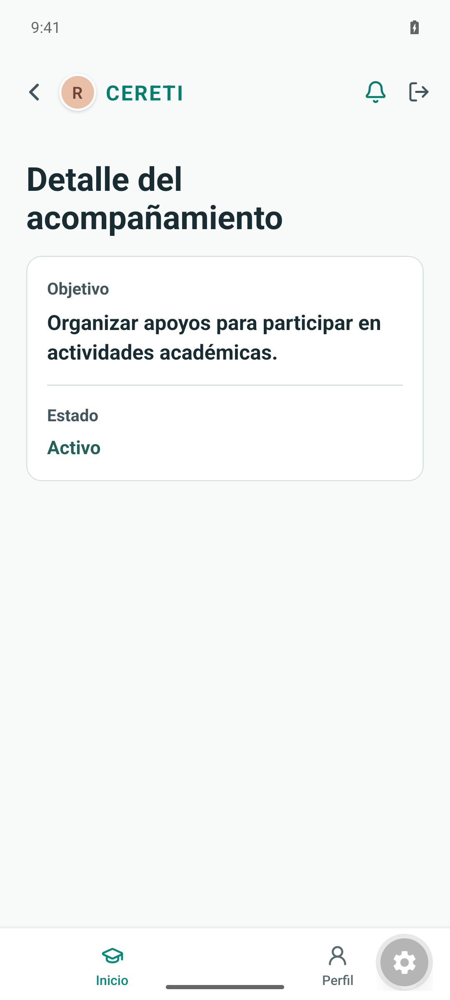
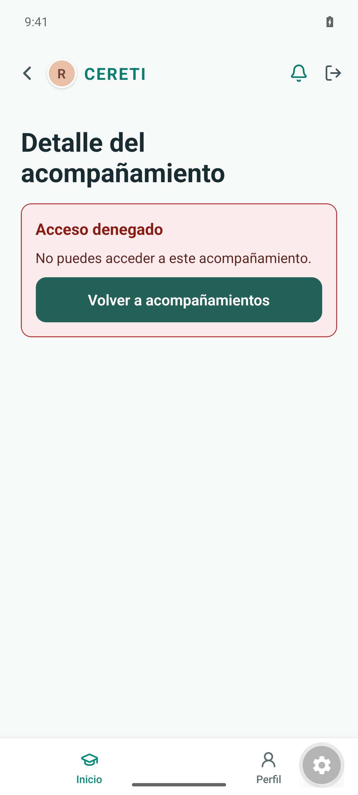

# Evidencia TI4-21

Captura del detalle minimizado de un acompañamiento asignado al Practicante, verificada en el emulador Android Pixel_8_API_35.

El acceso a identificadores no asignados o inexistentes muestra el mismo mensaje genérico (`No puedes acceder a este acompañamiento.`), verificado mediante las pruebas de navegación y del lector mock.
