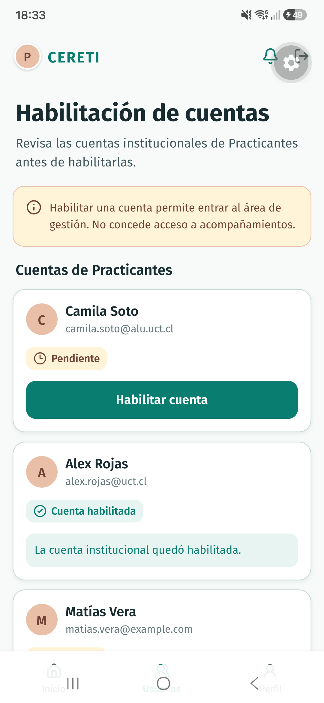
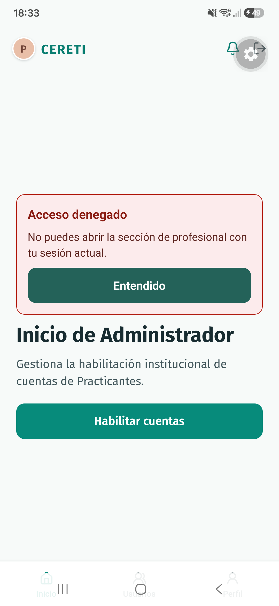

# Validación de permisos del Administrador, TI4-23

El recorrido se ejecutó el 26 de septiembre de 2026 en un Samsung SM-S911B conectado por USB, con el adaptador local de datos ficticios. Se generó e instaló el cliente Android con JDK 17 mediante `bun run mobile:android --device --no-bundler` y se conectó Metro por `adb reverse`.

## Checklist

- [x] Una cuenta institucional pendiente se habilita y muestra confirmación. La prueba de integración recorre Inicio, Habilitación de cuentas y el nuevo estado.
- [x] Una cuenta fuera de los dominios institucionales conserva el estado pendiente y muestra un error controlado que permite reintentar.
- [x] Habilitar una cuenta no concede acceso a acompañamientos. Una ruta directa de Practicante devuelve al Administrador sin consultar acompañamientos asignados.
- [x] Una ruta directa de solicitudes profesionales devuelve al Administrador sin consultar solicitudes ni agenda.
- [x] Las rutas y el puerto del Administrador sólo ofrecen inicio, perfil, lista y habilitación de cuentas. No ofrecen asignación de acompañamientos, notas internas, auditoría completa ni reportes avanzados.
- [x] En Android, habilitar una cuenta institucional y comprobar su confirmación.
- [x] Abrir por enlace directo las rutas de Profesional y Practicante. Ambas muestran acceso denegado, vuelven al inicio del Administrador y no exponen sus datos.

## Capturas Android

## Comprobaciones

`bun run --cwd apps/mobile test -- --runTestsByPath __tests__/administrator-accounts.test.tsx __tests__/navigation.test.tsx __tests__/professional-review.test.tsx` terminó con 36 pruebas aprobadas. Comprueba los casos permitidos, rechazados y de navegación entre roles, además del flujo profesional. La prueba de acceso directo confirma que los lectores de Practicante y Profesional no se llaman con una sesión de Administrador.
