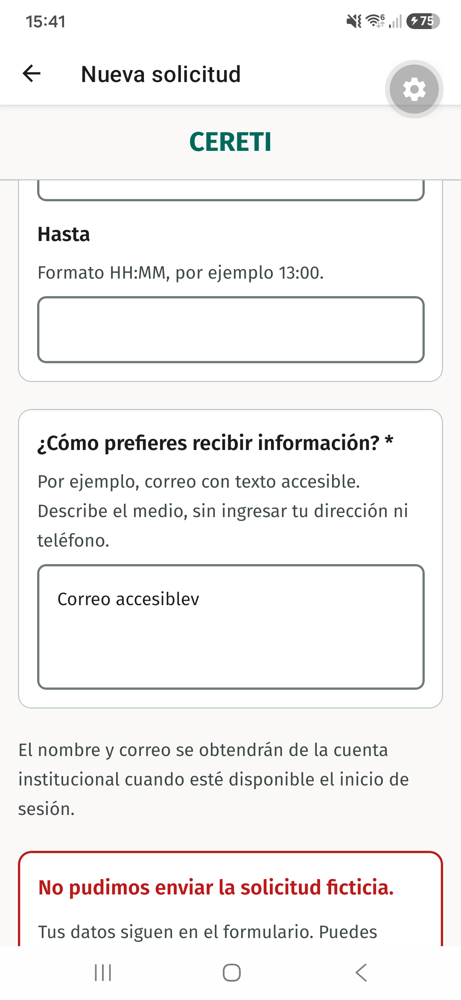
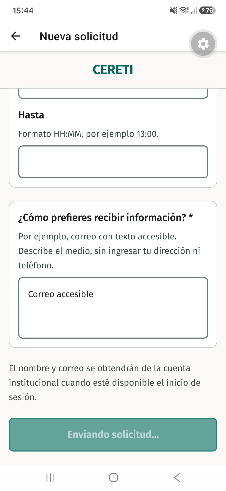
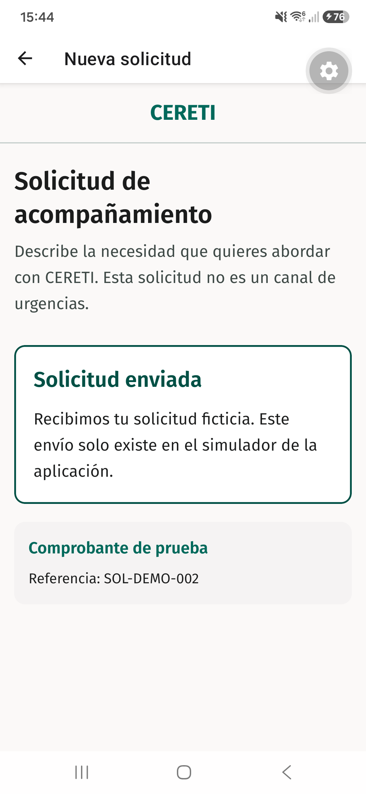

# Evidencia nativa de TI4-30

Recorrido ejecutado el 11 de septiembre de 2026 en un Samsung SM-S911B con Android 16 y Expo Go. El dispositivo se conectó por USB. Se ejecutó una sesión sin variables para el modo normal y otra con `EXPO_PUBLIC_STUDENT_REQUEST_DEMO_MODE=fail-once`.

Las capturas de los escenarios funcionales se tomaron sobre el commit `6120e1aba1985cb5e0edb2aa1dbdada1f8d6e72a`. La verificación visual posterior de los cambios de presentación se ejecutó sobre `57ce5145de1bcf8ddf99c498cc9ee6f3b6eb94db`.

## Modo normal

Sin la variable de escenario, el primer envío confirmó la solicitud como `SOL-DEMO-001`.

## Error controlado

El primer intento mostró el error y conservó los valores del formulario. La acción de reintento quedó disponible.

## Estado de envío y doble pulsación

En un segundo formulario se pulsó dos veces la acción durante los 600 ms del adaptador. La acción mostró `Enviando solicitud…`, quedó deshabilitada y la guarda del hook mantuvo una sola operación activa.

## Confirmación

El reintento del primer formulario produjo `SOL-DEMO-001`. El segundo formulario, después de la doble pulsación, produjo solamente `SOL-DEMO-002`; no apareció un tercer comprobante.

