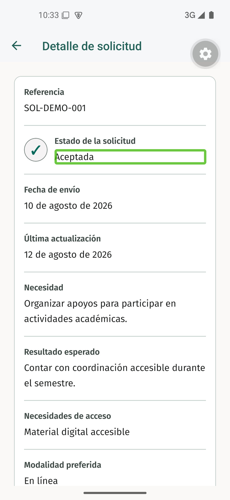

# Evidencia nativa de TI4-31

Recorrido ejecutado el 14 de septiembre de 2026 sobre el commit de código `344ef0a` en el AVD `Pixel_5_Liviano` con Android 15, API 35, el development build de CERETIME y TalkBack 15.0.0.639625893. La aplicación utilizó el escenario ficticio normal de `StudentAreaReader`, sin conectar un backend.

## Estado visible

El detalle de `SOL-DEMO-001` mostró el estado `Aceptada` junto al símbolo ✓. El texto identifica el estado por sí mismo y el símbolo aporta una segunda señal visual; el color verde es complementario.

## Verificación con TalkBack

TalkBack permaneció habilitado con exploración táctil y salida hablada mediante Google TTS. Al tocar `Aceptada`, Android enfocó un único nodo con la descripción `Estado de la solicitud: Aceptada` y solicitó la síntesis de voz. La jerarquía nativa impidió que el rótulo `Estado de la solicitud` y el símbolo ✓ recibieran foco, por lo que no se repitieron ni interrumpieron el anuncio.

Resultado manual: aprobado. El estudiante puede reconocer el estado por texto y símbolo, y TalkBack comunica juntos el nombre del campo y su valor.

## Verificación automatizada

| Comando                               | Resultado                                      |
| ------------------------------------- | ---------------------------------------------- |
| `cd apps/mobile && bun run test`      | 7 suites y 55 pruebas aprobadas.               |
| `cd apps/mobile && bun run typecheck` | Aprobado sin errores de TypeScript.            |
| `bun run lint`                        | Aprobado sin advertencias de Oxlint.           |
| `bun run format:check`                | 102 archivos revisados, todos con formato.     |
| `cspell lint` sobre el alcance        | 7 archivos revisados, sin palabras rechazadas. |
