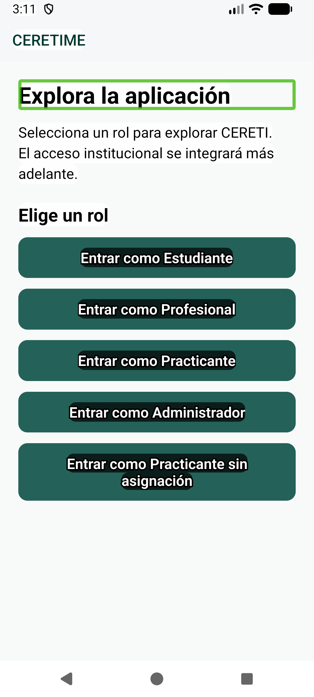

# Evidencia Android nativa de TI4-51

Las capturas se tomaron en la app nativa del commit `54f16c7`, en el emulador `Medium_Phone`, Android 17 (API 37), resolución 1080 × 2400. TalkBack estaba activo; el árbol nativo identifica `Entrar como Estudiante` como un botón con ese nombre accesible. Se usaron únicamente las pantallas públicas y datos ficticios.

Para la captura base se configuró `font_scale=1.15`, `high_text_contrast_enabled=0` y `transition_animation_scale=0`. Para texto ampliado se cambió `font_scale=1.5` y se mantuvieron las otras dos opciones. Para alto contraste se restauró `font_scale=1.15` y se activó `high_text_contrast_enabled=1`. TalkBack permaneció activo durante los tres escenarios.

Al ampliar el texto, las descripciones ocupan más líneas y las acciones siguen visibles y con nombre. Con alto contraste, el texto y las etiquetas de acción conservan una señal legible. La exploración nativa expone las acciones como botones; la interacción se mantuvo táctil y no se enviaron formularios.

La app se ejecutó con reducción de movimiento del sistema activa (`transition_animation_scale=0`). La prueba `accessibility-preferences-runtime.test.tsx` cambia el evento del sistema y comprueba el modo real de Reanimated en los valores JS y UI. Una imagen estática no demuestra la duración de cada animación por vista.
