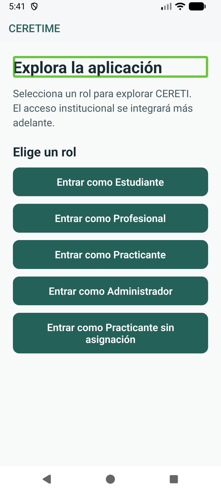
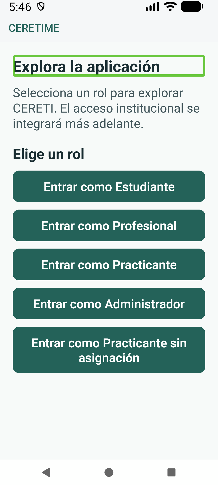

# Evidencia Android nativa de TI4-51

La comprobación se ejecutó sobre el commit `b45cf97` en `Medium_Phone`, Android 17 (API 37), resolución 1080 × 2400; TalkBack estaba activo en ambas capturas.

La captura base usa `font_scale=1.15`; la segunda usa `font_scale=1.5`, `high_text_contrast_enabled=0` y `transition_animation_scale=0.0` para aislar el cambio de tamaño y probar la preferencia de movimiento sin alterar el sistema de alto contraste.

El texto se amplía y ocupa más líneas al subir la escala del sistema; los botones siguen visibles y conservan sus nombres. El árbol nativo de accesibilidad expuso `Entrar como Estudiante` como botón, y la exploración táctil con TalkBack permitió abrir Student sin enviar el formulario ni ingresar datos.

La reducción de movimiento se activó con la escala de transición Android en `0.0`; la suite de preferencias verifica el evento `reduceMotionChanged` y el modo global de Reanimated. No se midió el tiempo de cada animación por vista.
