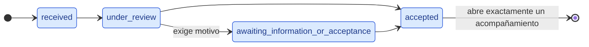

# Modelo de estados — Solicitud de acompañamiento

Fuente: TI2-7 (Sprint 1) y documento de requerimientos, sección "Estados y
ciclos de vida". Este archivo es la evidencia de cierre del issue; el modelo
ejecutable vive en [`state.ts`](./state.ts) y [`transitions.ts`](./transitions.ts).

## Implementado en Sprint 1

Las cuatro transiciones del diagrama son exactamente las de
`SPRINT_1_REQUEST_TRANSITIONS`. Cualquier otro par origen-destino es inválido,
incluidos los saltos hacia adelante y los retrocesos.

| Estado                               | Etiqueta en interfaz               | Rol que lo provoca                                          |
| ------------------------------------ | ---------------------------------- | ----------------------------------------------------------- |
| `received`                           | Recibida                           | Estudiante, o personal autorizado desde canal institucional |
| `under_review`                       | En revisión                        | Profesional de CERETI                                       |
| `awaiting_information_or_acceptance` | Esperando información o aceptación | Profesional de CERETI                                       |
| `accepted`                           | Aceptada                           | Profesional de CERETI                                       |

`received` es el estado inicial. La revisión es humana: no hay aceptación
automática, según RN-23 del documento de requerimientos.

## Declarado, no habilitado

Estos estados existen en el tipo `RequestState` para que el dominio quede
consistente y nadie invente nombres alternativos. Ninguna operación pública los
alcanza en este Cycle.

| Estado                         | Etiqueta en interfaz       | Por qué queda fuera de Sprint 1                                                                                                   |
| ------------------------------ | -------------------------- | --------------------------------------------------------------------------------------------------------------------------------- |
| `referred`                     | Derivada                   | Requiere contacto de CERETI y aceptación del estudiante antes de abrir acompañamiento (RN-24). Flujo completo en Cycle posterior. |
| `closed_without_accompaniment` | Cerrada sin acompañamiento | Fuera de alcance declarado en TI2-7 y TI2-21.                                                                                     |
| `cancelled`                    | Cancelada                  | Fuera de alcance declarado en TI2-7 y TI2-21.                                                                                     |

Sus transiciones de origen **no se modelan todavía**. El documento de
requerimientos marca los estados completos y sus excepciones como pendientes, y
el issue prohíbe inventarlas. Dibujarlas acá sería fijar una decisión que el
proyecto no ha tomado.

## Cómo se protege el alcance

`SPRINT_1_REQUEST_TRANSITIONS` tipa `from` y `to` como `Sprint1RequestState`,
no como `RequestState`. Agregar una transición hacia `referred`,
`closed_without_accompaniment` o `cancelled` no compila. La garantía es del
compilador, no de la disciplina de quien edite el archivo.

## Qué queda para otros issues

| Issue  | Qué le corresponde                                                                                     |
| ------ | ------------------------------------------------------------------------------------------------------ |
| TI2-21 | La función que aplica una transición, rechaza las inválidas y exige motivo.                            |
| TI2-16 | La persistencia: tabla de solicitudes y validadores de Convex derivados de estos literales.            |
| TI2-8  | Los contratos compartidos, incluida la entidad de solicitud y el mapa de estado a etiqueta en español. |
| TI2-22 | Las pruebas de caminos válidos e inválidos, y la validación del diagrama.                              |
