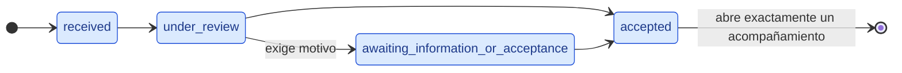

# Modelo de estados — Solicitud de acompañamiento

Fuente: TI2-7, TI2-21 y TI2-22 (Sprint 1), y el documento de requerimientos, sección "Estados y ciclos de vida". Este archivo es la evidencia de cierre de esos issues; el modelo ejecutable vive en [`state.ts`](./state.ts), [`transitions.ts`](./transitions.ts) y [`transition_policy.ts`](./transition_policy.ts).

## Implementado en Sprint 1



Las cuatro transiciones del diagrama son exactamente las de `SPRINT_1_REQUEST_TRANSITIONS`. Cualquier otro par origen-destino es inválido, incluidos los saltos hacia adelante y los retrocesos.

[`state_model.test.ts`](./state_model.test.ts) lee este archivo y falla si el diagrama o las tablas dejan de coincidir con `state.ts` y `transitions.ts`; si editas cualquiera de ellos, corre `bunx vitest run convex/domain/request`.

| Estado                               | Etiqueta en interfaz               | Rol que lo provoca                                          |
| ------------------------------------ | ---------------------------------- | ----------------------------------------------------------- |
| `received`                           | Recibida                           | Estudiante, o personal autorizado desde canal institucional |
| `under_review`                       | En revisión                        | Profesional de CERETI                                       |
| `awaiting_information_or_acceptance` | Esperando información o aceptación | Profesional de CERETI                                       |
| `accepted`                           | Aceptada                           | Profesional de CERETI                                       |

`received` es el estado inicial. La revisión es humana: no hay aceptación automática, según RN-23 del documento de requerimientos.

La columna de rol describe quién provoca cada estado en el flujo, no la autorización efectiva. Esa vive en [`permissions-matrix.md`](../authorization/permissions-matrix.md), que en este incremento cubre acompañamientos y notas internas y deja las solicitudes explícitamente fuera. Mientras eso no cambie, ningún control de acceso se apoya en esta columna.

## Política de transición

La política la entregó TI2-21 y vive en [`transition_policy.ts`](./transition_policy.ts). Es dominio puro: recibe un intento, decide si procede y devuelve el resultado como valor, sin leer ni escribir la base de datos. Persistir y decidir cuánto se le revela al cliente son responsabilidad de la capa de aplicación.

Un intento trae origen, destino, actor, instante y, cuando corresponde, motivo. El origen y el destino admiten cualquier estado declarado, incluidos los de un Cycle futuro: la política es el único punto que los rechaza, así ninguna capa superior necesita filtrarlos antes.

Hay cuatro causas de rechazo. Se evalúan de la más general a la más específica, de modo que la causa reportada es la primera que el llamador tiene que resolver.

| Causa                    | Cuándo se devuelve                                                                                                            |
| ------------------------ | ----------------------------------------------------------------------------------------------------------------------------- |
| `transition_not_allowed` | El par origen-destino no está en la tabla: saltos, retrocesos, quedarse en el mismo estado y cualquier estado de Cycle futuro |
| `actor_required`         | El identificador del actor llega vacío o solo con espacios                                                                    |
| `occurred_at_invalid`    | El instante no es un número finito y positivo                                                                                 |
| `reason_required`        | La fila exige motivo y no llegó, o llegó en blanco                                                                            |

Un intento rechazado no deja registro, y no por disciplina: la política retorna antes de construir la entrada, así que la entrada nunca llega a existir. Un intento aplicado sí la devuelve, con origen, destino, actor sin espacios sobrantes, instante y el motivo cuando lo hubo. La entrada se arma desde la fila de la tabla y no desde el intento, así solo puede contener estados de Sprint 1.

## Apertura del acompañamiento

CA-04 del documento de requerimientos exige que una solicitud aceptada cree exactamente el acompañamiento asociado. El dominio llega hasta la puerta: cuando un intento aplicado termina en `accepted`, el resultado marca que corresponde abrir el acompañamiento.

Esa marca no garantiza unicidad, y es deliberado. La política no conoce la solicitud ni su historial, así que repetir un intento válido la vuelve a emitir. Garantizar que se abra uno solo exige leer y actualizar el estado persistido de forma atómica, y eso es el caso de uso de TI2-24.

Lo que sí garantiza esta capa es que, partiendo del estado real, no hay segunda aceptación: [`transitions.test.ts`](./transitions.test.ts) fija que de la aceptación no sale ninguna fila, y [`transition_policy.test.ts`](./transition_policy.test.ts) acepta de verdad y comprueba que el segundo intento, partiendo del estado que dejó el primero, se rechaza.

## Declarado, no habilitado

Estos estados existen en el tipo `RequestState` para que el dominio quede consistente y nadie invente nombres alternativos. Ninguna operación pública los alcanza en este Cycle.

| Estado                         | Etiqueta en interfaz       | Por qué queda fuera de Sprint 1                                                                                                   |
| ------------------------------ | -------------------------- | --------------------------------------------------------------------------------------------------------------------------------- |
| `referred`                     | Derivada                   | Requiere contacto de CERETI y aceptación del estudiante antes de abrir acompañamiento (RN-24). Flujo completo en Cycle posterior. |
| `closed_without_accompaniment` | Cerrada sin acompañamiento | Fuera de alcance declarado en TI2-7 y TI2-21.                                                                                     |
| `cancelled`                    | Cancelada                  | Fuera de alcance declarado en TI2-7 y TI2-21.                                                                                     |

Sus transiciones de origen **no se modelan todavía**. El documento de requerimientos marca los estados completos y sus excepciones como pendientes, y el issue prohíbe inventarlas. Dibujarlas acá sería fijar una decisión que el proyecto no ha tomado.

## Cómo se protege el alcance

`SPRINT_1_REQUEST_TRANSITIONS` tipa `from` y `to` como `Sprint1RequestState`, no como `RequestState`. Agregar una transición hacia `referred`, `closed_without_accompaniment` o `cancelled` no compila. La garantía es del compilador, no de la disciplina de quien edite el archivo.

## Casos cubiertos por pruebas

Las pruebas del dominio de la solicitud viven en [`state.test.ts`](./state.test.ts), [`transitions.test.ts`](./transitions.test.ts), [`transition_policy.test.ts`](./transition_policy.test.ts), [`state_model.test.ts`](./state_model.test.ts) y [`request.test.ts`](./request.test.ts). `bun run test:convex` las corre junto al resto del backend; para correr solo estas:

```bash
bunx vitest run convex/domain/request
```

Positivos: las cuatro transiciones declaradas se aplican y devuelven actor, origen, destino, instante y el motivo cuando llega; el paso a espera acepta un motivo con texto y lo conserva; llegar a la aceptación marca que corresponde abrir el acompañamiento; el estado inicial es `received` y queda reconocido como estado con operación; los cuatro estados de Sprint 1 y los tres declarados para después tienen etiqueta visible y una sola definición; el diagrama dibuja exactamente las transiciones de la tabla, marca "exige motivo" donde la tabla lo exige, entra por el estado inicial y sale por la aceptación; la tabla no repite filas, no deja la solicitud donde ya estaba, alcanza todos los estados desde el inicial y lleva a la aceptación desde cualquiera de ellos.

Negativos: todo par ausente de la tabla se rechaza sin tocar el estado, incluidos los saltos, los retrocesos, quedarse en el mismo estado y aceptar dos veces, tanto con el par escrito a mano como partiendo del estado que dejó la primera aceptación; el paso a espera sin motivo, o con un motivo en blanco, se rechaza; el actor vacío o solo con espacios se rechaza; un instante que no es un número finito y positivo se rechaza; un rechazo no trae entrada de registro y deja el intento intacto, y cada causa declarada tiene un intento que la provoca; los tres estados declarados para Cycles futuros no quedan habilitados, no aparecen dibujados y no tienen fila en la tabla de Sprint 1; de la aceptación no sale ninguna transición.

Lo que estas pruebas no cubren, porque vive fuera del dominio: quién está autorizado a intentar una transición, la persistencia del estado y del registro, y la unicidad del acompañamiento.

## Auditoría y datos

Cada transición aplicada produce una entrada con actor, origen, destino, instante y motivo, destinada al registro append-only que exige RD-03: auditoría desde las interfaces normales, con actor, fecha, acción, recurso y resultado, y sin contenido sensible. El dominio devuelve la entrada y nada más: la tabla que la guarda no existe todavía y no se crea en este issue.

El motivo es texto para el estudiante y explica qué información falta. No lleva diagnósticos ni etiquetas clínicas, por la Ley 21.719. Todo lo que se prueba acá opera con datos ficticios.

## Qué queda para otros issues

| Issue  | Qué le corresponde                                                                                                                   |
| ------ | ------------------------------------------------------------------------------------------------------------------------------------ |
| TI2-21 | La función que aplica una transición, rechaza las inválidas y exige motivo.                                                          |
| TI2-16 | La persistencia: tabla de solicitudes y validadores de Convex derivados de estos literales.                                          |
| TI2-8  | Los contratos compartidos, incluida la entidad de solicitud y el mapa de estado a etiqueta en español.                               |
| TI2-24 | La apertura única del acompañamiento: leer y actualizar el estado persistido de forma atómica, según CA-04.                          |
| TI2-22 | Entregado: el diagrama y las tablas atados al código, las pruebas propias de los estados y de la tabla como grafo, y este documento. |
