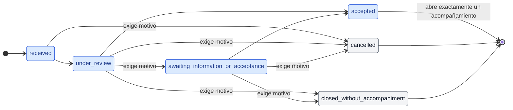

# Modelo de estados — Solicitud de acompañamiento

Fuente: TI2-7, TI2-21 y TI2-22 (Sprint 1), TI2-85 (Sprint 2) y el documento de requerimientos, sección "Estados y ciclos de vida". Este archivo es la evidencia de cierre de esos issues; el modelo ejecutable vive en [`state.ts`](./state.ts), [`transitions.ts`](./transitions.ts) y [`transition_policy.ts`](./transition_policy.ts).

## Diagrama



Las transiciones del diagrama son exactamente las de `SPRINT_1_REQUEST_TRANSITIONS` y `CLOSURE_REQUEST_TRANSITIONS`. Cualquier otro par origen-destino es inválido, incluidos los saltos hacia adelante, los retrocesos y cualquier salida de un estado terminal.

[`state_model.test.ts`](./state_model.test.ts) lee este archivo y falla si el diagrama o las tablas dejan de coincidir con `state.ts` y `transitions.ts`; si editas cualquiera de ellos, corre `bunx vitest run convex/domain/requests`.

## Implementado en Sprint 1

| Estado                               | Etiqueta en interfaz               | Rol que lo provoca                                          |
| ------------------------------------ | ---------------------------------- | ----------------------------------------------------------- |
| `received`                           | Recibida                           | Estudiante, o personal autorizado desde canal institucional |
| `under_review`                       | En revisión                        | Profesional de CERETI                                       |
| `awaiting_information_or_acceptance` | Esperando información o aceptación | Profesional de CERETI                                       |
| `accepted`                           | Aceptada                           | Profesional de CERETI                                       |

`received` es el estado inicial. La revisión es humana: no hay aceptación automática, según RN-23 del documento de requerimientos.

La columna de rol describe quién provoca cada estado en el flujo, no la autorización efectiva. Esa vive en [`permissions-matrix.md`](../authorization/permissions-matrix.md), que en este incremento cubre acompañamientos y notas internas y deja las solicitudes explícitamente fuera. Mientras eso no cambie, ningún control de acceso se apoya en esta columna.

## Implementado en Sprint 2 (TI2-85)

| Estado                         | Etiqueta en interfaz       | Rol que lo provoca                    |
| ------------------------------ | -------------------------- | ------------------------------------- |
| `closed_without_accompaniment` | Cerrada sin acompañamiento | Profesional de CERETI con toma activa |
| `cancelled`                    | Cancelada                  | Estudiante dueño de la solicitud      |

Los dos son terminales: cierran la solicitud sin abrir acompañamiento y de ellos no sale ninguna transición. Una necesidad posterior empieza con una solicitud nueva.

## Cierres sin acompañamiento

| Origen                               | Destino                        | Quién lo intenta                 | Exige motivo |
| ------------------------------------ | ------------------------------ | -------------------------------- | ------------ |
| `received`                           | `cancelled`                    | Estudiante dueño, cuenta vigente | Sí           |
| `under_review`                       | `cancelled`                    | Estudiante dueño, cuenta vigente | Sí           |
| `awaiting_information_or_acceptance` | `cancelled`                    | Estudiante dueño, cuenta vigente | Sí           |
| `under_review`                       | `closed_without_accompaniment` | Profesional vigente con toma     | Sí           |
| `awaiting_information_or_acceptance` | `closed_without_accompaniment` | Profesional vigente con toma     | Sí           |

Los orígenes son una decisión provisional de TI2-85: el documento de requerimientos deja los estados completos y sus excepciones pendientes (PV-04). La regla que los ordena es que la solicitud se puede cancelar o cerrar mientras sigue abierta y nunca después de aceptarla, porque la aceptación ya abrió su acompañamiento. El Profesional no cierra desde `received` porque tomarla ya la pasa a `under_review`.

El motivo es obligatorio en los cinco pasos. Al cerrar es la "razón comprensible" que pide la especificación del prototipo; al cancelar deja trazado por qué terminó la solicitud. Esta regla es de solicitudes y no se mezcla con la de cancelar una atención, donde CERETI debe dar motivo y para el estudiante es opcional.

La columna "Quién lo intenta" la exige la capa de aplicación (`cancelRequest` y `closeRequestWithoutAccompaniment` en [`commands.ts`](../../application/requests/commands.ts)), no esta tabla: el dominio decide qué pares existen y si falta el motivo.

## Política de transición

La política la entregó TI2-21 y vive en [`transition_policy.ts`](./transition_policy.ts). Es dominio puro: recibe un intento, decide si procede y devuelve el resultado como valor, sin leer ni escribir la base de datos. Persistir y decidir cuánto se le revela al cliente son responsabilidad de la capa de aplicación.

Un intento trae origen, destino, actor, instante y, cuando corresponde, motivo. El origen y el destino admiten cualquier estado declarado, incluido `referred`: la política es el único punto que los rechaza, así ninguna capa superior necesita filtrarlos antes.

Hay cuatro causas de rechazo. Se evalúan de la más general a la más específica, de modo que la causa reportada es la primera que el llamador tiene que resolver.

| Causa                    | Cuándo se devuelve                                                                                                                     |
| ------------------------ | -------------------------------------------------------------------------------------------------------------------------------------- |
| `transition_not_allowed` | El par origen-destino no está en las tablas: saltos, retrocesos, quedarse en el mismo estado, salir de un estado terminal y `referred` |
| `actor_required`         | El identificador del actor llega vacío o solo con espacios                                                                             |
| `occurred_at_invalid`    | El instante no es un número finito y positivo                                                                                          |
| `reason_required`        | La fila exige motivo y no llegó, o llegó en blanco                                                                                     |

Un intento rechazado no deja entrada en el historial, y no por disciplina: la política retorna antes de construirla, así que nunca llega a existir. Un intento aplicado sí la devuelve, con origen, destino, actor sin espacios sobrantes, instante y el motivo recortado cuando lo hubo. La entrada se arma desde la fila de la tabla y no desde el intento, así solo puede contener estados persistibles.

## Apertura del acompañamiento

CA-04 del documento de requerimientos exige que una solicitud aceptada cree exactamente el acompañamiento asociado. El dominio llega hasta la puerta: cuando un intento aplicado termina en `accepted`, el resultado marca que corresponde abrir el acompañamiento. Cancelar o cerrar nunca lo marcan.

Esa marca no garantiza unicidad, y es deliberado. La política no conoce la solicitud ni su historial, así que repetir un intento válido la vuelve a emitir. Garantizar que se abra uno solo exige leer y actualizar el estado persistido de forma atómica, y eso es el caso de uso de TI2-24.

Lo que sí garantiza esta capa es que, partiendo del estado real, no hay segunda aceptación: [`transitions.test.ts`](./transitions.test.ts) fija que de la aceptación no sale ninguna fila, y [`transition_policy.test.ts`](./transition_policy.test.ts) acepta de verdad y comprueba que el segundo intento, partiendo del estado que dejó el primero, se rechaza. Con los cierres pasa lo mismo: tras cancelar o cerrar, ningún intento posterior procede.

## Declarado, no habilitado

Este estado existe en el tipo `RequestState` para que el dominio quede consistente y nadie invente un nombre alternativo. Ninguna operación lo alcanza en este Cycle.

| Estado     | Etiqueta en interfaz | Por qué queda fuera                                                                                                               |
| ---------- | -------------------- | --------------------------------------------------------------------------------------------------------------------------------- |
| `referred` | Derivada             | Requiere contacto de CERETI y aceptación del estudiante antes de abrir acompañamiento (RN-24). Flujo completo en Cycle posterior. |

Sus transiciones **no se modelan todavía**. El documento de requerimientos marca los estados completos y sus excepciones como pendientes. Dibujarlas acá sería fijar una decisión que el proyecto no ha tomado.

## Cómo se protege el alcance

`SPRINT_1_REQUEST_TRANSITIONS` tipa `from` y `to` como `Sprint1RequestState`, y `CLOSURE_REQUEST_TRANSITIONS` tipa `from` como `Sprint1RequestState` y `to` como `ClosureRequestState`. Agregar a la primera un cierre, agregar a la segunda una salida desde un cierre, o agregar a cualquiera una transición hacia `referred` no compila. La garantía es del compilador, no de la disciplina de quien edite el archivo.

## Contrato público

`api.presentation.requests.*` sigue entregando solo los cuatro estados de Sprint 1. Mobile deriva sus tipos de ese contrato y su mapeo de estados es exhaustivo, así que ampliarlo es un cambio incompatible que se coordina con TI4 en la tarea que publique cancelar y cerrar. Hasta entonces los dos casos de uso no tienen entrada pública y ninguna lectura pública entrega una fila cerrada o cancelada con un estado que los clientes no saben mostrar. Los listados paginados (`listOwnRequests` y `listAuthorizedRequests`) la omiten, para que una sola fila cerrada no deje sin respuesta el listado completo; el detalle (`getRequest`) y las mutations la rechazan con `toSprint1AccompanimentRequest`, porque ahí entregarla violaría el contrato.

## Casos cubiertos por pruebas

Las pruebas del dominio de la solicitud viven en [`state.test.ts`](./state.test.ts), [`transitions.test.ts`](./transitions.test.ts), [`transition_policy.test.ts`](./transition_policy.test.ts), [`state_model.test.ts`](./state_model.test.ts) y [`request.test.ts`](./request.test.ts). `bun run test:convex` las corre junto al resto del backend; para correr solo estas:

```bash
bunx vitest run convex/domain/requests
```

Positivos: las transiciones declaradas se aplican y devuelven actor, origen, destino, instante y el motivo cuando llega; el paso a espera y los cinco cierres conservan el motivo recortado; llegar a la aceptación marca que corresponde abrir el acompañamiento y ningún cierre lo marca; el estado inicial es `received` y queda reconocido como estado con operación; los siete estados tienen etiqueta visible y una sola definición; el diagrama dibuja exactamente las transiciones de las dos tablas, marca "exige motivo" donde la tabla lo exige, entra por el estado inicial y sale por los tres estados terminales; las tablas no repiten filas, no dejan la solicitud donde ya estaba, alcanzan todos los estados persistibles desde el inicial, y desde todo estado abierto se puede cancelar; la proyección adapta una fila cerrada o cancelada.

Negativos: todo par ausente de las tablas se rechaza sin tocar el estado, incluidos los saltos, los retrocesos, quedarse en el mismo estado, aceptar dos veces, cancelar o cerrar una aceptada y repetir un cierre, tanto con el par escrito a mano como partiendo del estado que dejó el primer intento; el paso a espera y los cierres sin motivo, o con un motivo en blanco, se rechazan; el actor vacío o solo con espacios se rechaza; un instante que no es un número finito y positivo se rechaza; un rechazo no trae entrada de historial y deja el intento intacto, y cada causa declarada tiene un intento que la provoca; `referred` no queda habilitado, no aparece dibujado y no tiene fila; el Profesional no cierra una recibida; el contrato público de Sprint 1 rechaza una fila cerrada o cancelada.

Lo que estas pruebas no cubren, porque vive fuera del dominio: quién está autorizado a intentar una transición, la persistencia del estado y de su historial, el evento de auditoría y la unicidad del acompañamiento. Las pruebas de integración de los dos cierres viven en [`requests.test.ts`](../../tests/requests.test.ts) y [`acceptance.test.ts`](../../tests/acceptance.test.ts).

## Historial de cambios y auditoría

Una transición aplicada deja dos rastros distintos, y no deben confundirse.

El **historial de cambios de estado** es parte de la solicitud. Cada transición aplicada produce una entrada con origen, destino, actor, instante y, cuando lo hubo, el motivo; la capa de aplicación la guarda en `requestTransitions`, junto al estado resultante y en la misma transacción, como hacen los casos de uso de TI2-9. El actor es el Profesional o, al cancelar, el propio Estudiante. El motivo se conserva ahí porque le explica al estudiante qué información falta o por qué se cerró o, al cancelar, deja trazado por qué el Estudiante terminó la solicitud, y queda protegido por el mismo control de acceso que la solicitud.

El **evento de auditoría** es lo que exige RD-03: registra solo actor, fecha, acción, recurso y resultado, sin contenido sensible, como piden también RF-31, RN-19 y RNF-11. **El motivo no se copia a la bitácora de auditoría**: es texto libre y puede traer necesidades de acceso u otros datos sensibles. El evento de auditoría de las transiciones de solicitud todavía no tiene tabla y no se crea en este issue.

Quien escribe el motivo no debe incluir diagnósticos ni etiquetas clínicas, por la Ley 21.719. Como el sistema no puede garantizar qué texto recibe, el motivo se trata como potencialmente sensible. Todo lo que se prueba acá opera con datos ficticios.

## Qué queda para otros issues

| Issue  | Qué le corresponde                                                                                                                                                   |
| ------ | -------------------------------------------------------------------------------------------------------------------------------------------------------------------- |
| TI2-21 | La función que aplica una transición, rechaza las inválidas y exige motivo.                                                                                          |
| TI2-16 | La persistencia: tabla de solicitudes y validadores de Convex derivados de estos literales.                                                                          |
| TI2-8  | Los contratos compartidos, incluida la entidad de solicitud y el mapa de estado a etiqueta en español.                                                               |
| TI2-24 | La apertura única del acompañamiento: leer y actualizar el estado persistido de forma atómica, según CA-04.                                                          |
| TI2-22 | Entregado: el diagrama y las tablas atados al código, las pruebas propias de los estados y de la tabla como grafo, y este documento.                                 |
| TI2-85 | Entregado: los cierres sin acompañamiento en dominio y aplicación, con sus pruebas. La entrada pública y la ampliación del contrato quedan sin tarea asignada (TI4). |
